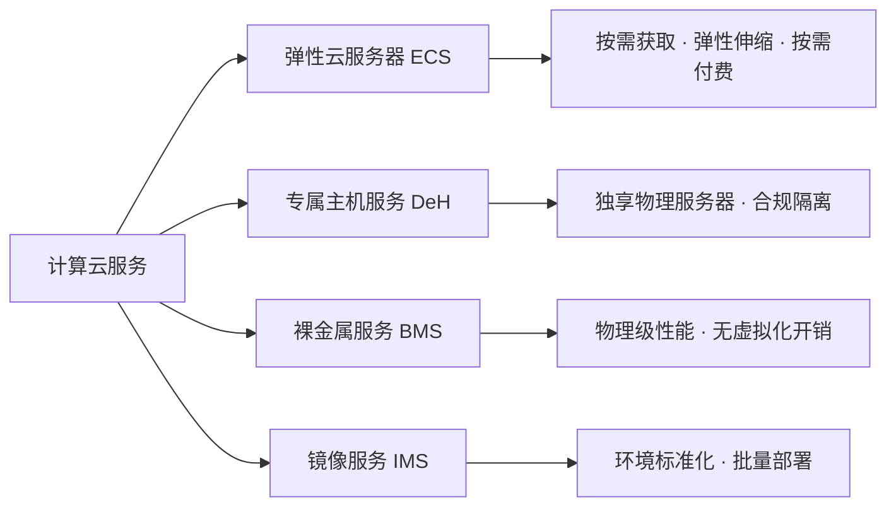
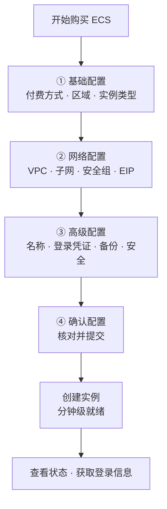

# 第二章 云中的计算

> 本章导读：计算云服务是云计算的核心组成部分。本章系统介绍弹性云服务器（ECS）、专属主机服务（DeH）、裸金属服务（BMS）和镜像服务（IMS）四大计算云服务，并通过"快速获取一台 ECS"的完整流程，帮助读者建立从理论到实践的整体认知。

## 目录

- [一、计算云服务概览](#一计算云服务概览)
- [二、弹性云服务器（ECS）](#二弹性云服务器ecs)
  - [2.1 核心特点](#21-核心特点)
  - [2.2 快速获取一台 ECS 服务器](#22-快速获取一台-ecs-服务器)
- [三、专属主机服务（DeH）](#三专属主机服务deh)
- [四、裸金属服务（BMS）](#四裸金属服务bms)
- [五、镜像服务（IMS）](#五镜像服务ims)
- [六、计算云服务对比与选型](#六计算云服务对比与选型)
- [七、本章小结](#七本章小结)

---

## 一、计算云服务概览

计算云服务是云计算的核心组成部分，提供可弹性伸缩的计算资源，使用户能够按需获取和释放计算能力，无需预先采购硬件。计算云服务主要包含**弹性云服务器（ECS）**、**专属主机服务（DeH）**、**裸金属服务（BMS）**和**镜像服务（IMS）**等。

**四类服务定位速览：**

| 服务 | 资源形态 | 核心定位 | 典型场景 |
| --- | --- | --- | --- |
| ECS | 虚拟机（共享物理机） | 通用计算，弹性伸缩 | Web 应用、中小型业务、开发测试 |
| DeH | 独享物理机（虚拟化） | 合规隔离 + 资源独享 | 金融、政务、医疗等合规要求高的行业 |
| BMS | 裸物理机（无虚拟化） | 极致性能 | 核心数据库、高性能计算、SAP HANA |
| IMS | 镜像（软件模板） | 环境标准化与快速部署 | 批量部署、备份迁移、跨账号共享 |

---

## 二、弹性云服务器（ECS）

**弹性云服务器（ECS，Elastic Cloud Server）**是一种可随时自助获取、可弹性伸缩的云服务器，帮助用户打造可靠、安全、灵活、高效的应用环境。用户可以根据业务需求灵活选择 CPU、内存、存储、网络等配置，并支持随时调整规格，实现按需付费。

### 2.1 核心特点

| 特点 | 说明 |
| --- | --- |
| **弹性伸缩** | 支持手动或自动调整实例数量与规格，从容应对业务波动（如秒杀、大促等流量高峰） |
| **快速部署** | 分钟级获取云服务器，大幅缩短业务上线时间 |
| **高可用性** | 支持多可用区部署、故障自动迁移，保障业务连续性 |
| **安全隔离** | 基于虚拟化技术实现租户间隔离，同时支持安全组、密钥对等安全措施 |
| **多种计费模式** | 按需计费、包年/包月、竞价计费等，满足不同成本需求 |

### 2.2 快速获取一台 ECS 服务器

购买 ECS 时需要进行一系列配置，主要包括**基础配置、网络配置、高级配置和确认配置**四个步骤。

#### （1）基础配置

**① 付费方式**

| 计费模式 | 计费方式 | 优点 | 注意事项 | 适用场景 |
| --- | --- | --- | --- | --- |
| 按需计费 | 按实际使用时长付费 | 灵活，随开随停 | 单价较高 | 短期任务、业务突增、测试环境 |
| 包年/包月 | 预付费 | 单价更低，成本可控 | 需提前规划资源 | 长期稳定业务 |
| 竞价计费 | 以竞价方式获取闲置资源 | 价格大幅优惠 | 资源可能被系统回收 | 无状态、可中断的批处理任务 |

**② 区域（Region）与可用区（AZ）**

- **区域（Region）**：选择云服务器所在的物理数据中心位置，建议**靠近用户群体**以降低网络延迟。
- **可用区（AZ，Availability Zone）**：同一区域内相互独立的故障域，跨可用区部署可进一步提升高可用性。

**③ 实例类型**

实例类型决定云服务器的 vCPU、内存等规格，不同实例类型侧重不同应用场景。以华为云为例，实例类型命名格式为 **`类型字母 + 代系数字 + 规格大小 + 内存比`**，如 `s6.large.2`、`c6.xlarge.4`、`m6.2xlarge.8`。

**第一部分（字母）：实例系列 / 应用场景**

| 字母 | 系列 | 特点 | 适用场景 |
| --- | --- | --- | --- |
| s | 通用型（Standard） | 计算、内存和网络资源均衡 | 通用工作负载 |
| c | 计算型（Compute） | 高 CPU 性能 | 高性能计算、Web 前端 |
| m | 内存型（Memory） | 高内存配置 | 内存数据库、大数据分析 |
| g | GPU 加速型 | 搭载 GPU | 深度学习、图形渲染 |
| h | 高主频型 | CPU 主频更高 | 对单核性能要求高的场景 |

**第二部分（数字）：代系**，数字越大表示硬件平台越新，例如 `6` 代表第六代实例。

**第三部分（规格大小）：**vCPU 数量参考

| 规格 | vCPU 数量 |
| --- | --- |
| large | 2 vCPU |
| xlarge | 4 vCPU |
| 2xlarge | 8 vCPU |
| 4xlarge | 16 vCPU |
| 8xlarge | 32 vCPU |

> 注：具体 vCPU 数量与实例系列有关，但通常按 large = 2、xlarge = 4、2xlarge = 8 依次类推。

**第四部分（数字）：内存与 vCPU 的比率**（每 vCPU 对应的内存，单位 GB）

| 比率 | 含义 | 适用场景 |
| --- | --- | --- |
| 2 | 1 vCPU : 2 GB 内存 | 通用场景 |
| 4 | 1 vCPU : 4 GB 内存 | 内存密集型场景 |
| 8 | 1 vCPU : 8 GB 内存 | 大型内存数据库等 |

**命名示例：**

| 实例 | 解析 |
| --- | --- |
| `s6.large.2` | 通用型第六代实例，2 vCPU，4 GB 内存（2 vCPU × 2 GB/vCPU） |
| `c6.xlarge.4` | 计算型第六代实例，4 vCPU，16 GB 内存（4 vCPU × 4 GB/vCPU） |
| `m6.2xlarge.8` | 内存型第六代实例，8 vCPU，64 GB 内存（8 vCPU × 8 GB/vCPU） |

#### （2）网络配置

| 配置项 | 说明 |
| --- | --- |
| 虚拟私有云（VPC） | 选择或创建 VPC，为云服务器提供隔离的网络环境 |
| 子网 | 在 VPC 内选择子网，决定云服务器的 IP 地址段 |
| 安全组 | 配置入方向和出方向规则，控制网络访问 |
| 弹性公网 IP（EIP） | 如需从公网访问，可绑定 EIP，支持按带宽或按流量计费 |
| 网卡 | 可配置主网卡和扩展网卡，支持多网卡场景 |

#### （3）高级配置

| 配置项 | 说明 |
| --- | --- |
| 云服务器名称 | 自定义实例名称，便于管理 |
| 登录凭证 | 选择密钥对或密码方式登录，**密钥对更安全，推荐使用** |
| 云备份 | 开启后可定期自动备份云服务器数据 |
| 主机安全 | 安装主机安全 Agent，提供入侵检测、漏洞管理等安全能力 |
| 高级选项 | 用户数据注入（Cloud-Init）、委托、云服务器组等 |

#### （4）确认配置

检查所有配置项，确认无误后提交购买。提交后系统开始创建云服务器，通常**几分钟内即可就绪**。创建完成后可通过**管理控制台或 API** 查看实例状态，获取登录信息。

---

## 三、专属主机服务（DeH）

**专属主机服务（DeH，Dedicated Host）**是将物理服务器资源以专属方式分配给单个用户使用，用户可独享整台物理服务器的计算资源，并在其上创建和管理云服务器。

### 核心特点

| 特点 | 说明 |
| --- | --- |
| **资源独享** | 整台物理服务器由单个用户独享，避免"吵闹邻居"问题，性能稳定 |
| **合规性** | 满足某些行业对物理隔离的合规要求 |
| **灵活管理** | 可在专属主机上创建多个不同规格的云服务器，并支持资源调度 |
| **成本可控** | 可结合按需或包周期计费，适合长期大规模业务 |

### 适用场景

金融、政务、医疗等对安全隔离和性能要求极高的行业，以及需要软件许可证绑定的场景。

---

## 四、裸金属服务（BMS）

**裸金属服务（BMS，Bare Metal Server）**为用户提供物理服务器级别的计算资源，兼具传统物理机的性能优势和云服务的弹性与便捷性。

### 核心特点

| 特点 | 说明 |
| --- | --- |
| **物理级性能** | 无虚拟化开销，完全独占物理硬件，适合高性能计算、核心数据库等 |
| **安全隔离** | 物理级隔离，满足高安全要求 |
| **快速交付** | 分钟级获取物理服务器，无需等待硬件采购 |
| **兼容性** | 支持用户自定义操作系统和软件环境，与本地数据中心架构一致 |
| **硬盘可备份** | 支持挂载云硬盘，并可利用云备份服务对系统盘和数据盘进行定期备份；即使物理服务器故障，也可通过备份快速恢复 |

### 适用场景

核心数据库、大数据处理、高性能计算、SAP HANA 等对性能要求极致的场景。

---

## 五、镜像服务（IMS）

**镜像服务（IMS，Image Management Service）**提供云服务器操作系统镜像的管理功能，用户可使用镜像快速创建云服务器，实现环境标准化和批量部署。

### 镜像类型

| 镜像类型 | 来源 | 特点 | 可见范围 |
| --- | --- | --- | --- |
| 原生镜像（公共镜像） | 云服务商提供的主流操作系统（Ubuntu、CentOS、Windows Server 等） | 经过安全加固和优化，可直接使用 | 所有用户 |
| 市场镜像 | 第三方服务商或社区提供，可能包含特定应用环境（LAMP、WordPress、数据库等） | 开箱即用，可在云市场选购 | 所有用户 |
| 私有镜像 | 基于已有云服务器或外部镜像文件创建，包含自定义配置和应用 | 用于快速复制相同环境 | 仅创建者 |
| 共享镜像 | 其他用户共享的私有镜像 | 所有者授权后，接收方在指定区域可使用 | 被授权的用户 |

### 镜像服务的作用

| 作用 | 说明 |
| --- | --- |
| **环境标准化** | 将配置好的操作系统和应用打包成镜像，确保多台服务器环境一致 |
| **快速部署** | 通过镜像可在几分钟内批量创建相同配置的云服务器 |
| **备份与迁移** | 可将云服务器制作为镜像进行备份，或在不同区域间迁移 |
| **跨账号共享** | 通过共享镜像实现团队协作或商业化分发 |

---

## 六、计算云服务对比与选型

| 对比维度 | ECS | DeH | BMS |
| --- | --- | --- | --- |
| 资源形态 | 共享物理机的虚拟机 | 独享物理机的虚拟机 | 裸物理机 |
| 虚拟化开销 | 有 | 有 | 无 |
| 性能表现 | 一般 | 稳定（无"吵闹邻居"） | 极致 |
| 隔离级别 | 租户级（逻辑隔离） | 物理级独享 | 物理级隔离 |
| 弹性伸缩 | 强（分钟级/秒级） | 中等（主机内调度） | 中等 |
| 成本 | 低（共享资源） | 较高（独享整机） | 最高（独占硬件） |
| 适用场景 | 通用业务、开发测试 | 合规要求高的行业 | 核心数据库、高性能计算 |

**选型建议：**

- **大多数通用业务**（Web 应用、中小型系统、开发测试）→ 选择 **ECS**，性价比最高、弹性最好；
- **行业合规 + 性能稳定**（金融、政务、医疗）→ 选择 **DeH**，独享物理资源且满足物理隔离要求；
- **极致性能 + 无虚拟化开销**（核心数据库、SAP HANA、高性能计算）→ 选择 **BMS**；
- **任何需要批量部署、环境复制或迁移的场景** → 结合 **IMS** 镜像服务，实现环境标准化与快速交付。

---

## 七、本章小结

本章介绍了计算云服务的主要组成部分：

1. **弹性云服务器（ECS）**是使用最广泛的基础计算服务，支持弹性伸缩、快速部署、高可用与多种计费模式；
2. **专属主机（DeH）**与**裸金属（BMS）**为特殊需求提供更高性能和隔离性；
3. **镜像服务（IMS）**为环境标准化和快速部署提供支撑。

在实际应用中，用户可根据业务需求选择合适的计算服务组合，甚至将 ECS、DeH、BMS 与 IMS 灵活搭配，构建高效、安全、经济的云上计算架构。
